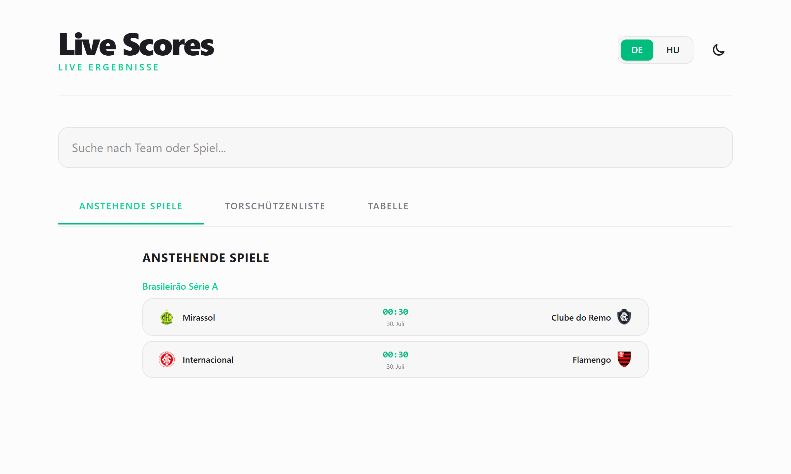
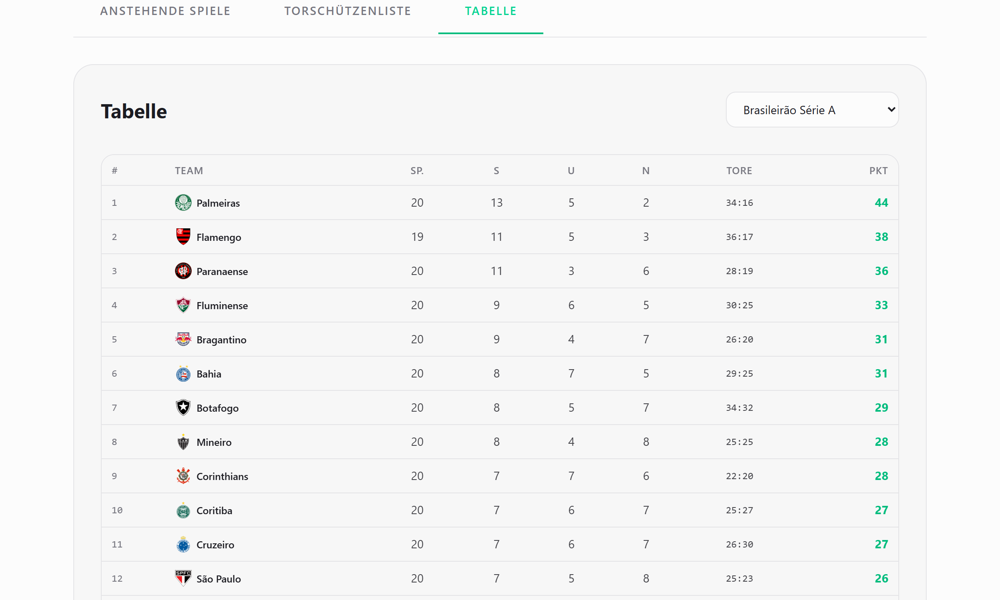
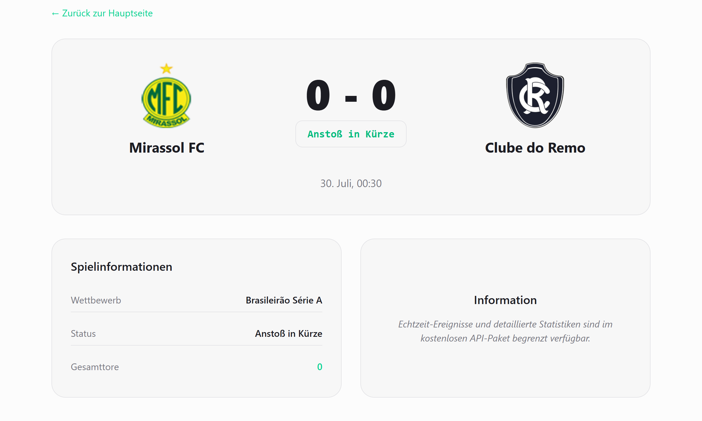
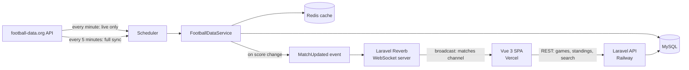

# Live Score Engine

Real-time football score tracker for top European and South American leagues — live updates over WebSockets, standings, top scorers, and search.

[](https://vuejs.org/)
[](https://www.typescriptlang.org/)
[](https://laravel.com/)
[](https://reverb.laravel.com/)
[](https://redis.io/)

**Live demo:** [scores-theta.vercel.app](https://scores-theta.vercel.app/)

---

## Screenshots

| Live matches | Standings | Match detail |
|---|---|---|
|  |  |  |

---

## Overview

Live Score Engine tracks matches configured for `PL`, `PD`, `SA`, `BL1`, `FL1`, `BSA`, `CLI`, `WC`, and `EC` (Premier League, La Liga, Serie A, Bundesliga, Ligue 1, Brasileirão Série A, Copa Libertadores, the World Cup, and the European Championship). A two-speed sync job keeps data fresh: live matches refresh every minute, a full sync (teams + fixtures across all configured competitions) runs every five minutes, and stale matches are cleaned up daily. Every score change is pushed instantly to connected browsers over a WebSocket connection — no polling required. The frontend is a Vue 3 + TypeScript SPA on Vercel; the backend is a Laravel 12 API with its own WebSocket server (Laravel Reverb) on Railway, backed by MySQL and Redis.

> Live coverage depends on the [football-data.org](https://www.football-data.org/) plan in use — on the free tier, not every competition or fixture may sync in real time; check `sports:sync` output to see what's actually populating for your API key.

## Architecture



- **Data ingestion:** `sports:sync --live-only` runs every minute and updates only in-progress matches; a full `sports:sync` runs every five minutes and refreshes teams and fixtures for all configured competitions. A daily job removes matches older than 30 days.
- **Real-time push:** on any score change, a `MatchUpdated` event broadcasts over a public `matches` Reverb channel; the frontend subscribes via `laravel-echo` and updates instantly, no refresh needed.
- **REST API:** the frontend also calls the Laravel API directly for the initial page load, filtered game lists (by date, competition, live-only), standings, top scorers, and search — all behind a custom IP-based rate limiter (120 requests/minute).

## Tech Stack

| | Frontend | Backend |
|---|---|---|
| Core | Vue 3 (Composition API, `<script setup>`), TypeScript, Vite | Laravel 12, PHP 8.2 |
| Routing | Vue Router (Home / match detail / team detail) | — |
| Real-time client | `laravel-echo` + `pusher-js` (protocol-compatible WebSocket client) | **Laravel Reverb** — self-hosted WebSocket server |
| State | Pinia (`matchStore`, `uiStore`) | Redis (`predis/predis`) — caching for external API responses |
| API layer | Axios | Laravel API Resources (`GameResource`, `TeamResource`) |
| i18n | vue-i18n (Hungarian / German) | — |
| External data | — | [football-data.org](https://www.football-data.org/) v4 API |
| Styling | Tailwind CSS | — |
| Testing | Vitest, Playwright | PHPUnit |
| Deployment | Vercel | Railway |

## Key Features

- **Live match tracker** — `PL`, `PD`, `SA`, `BL1`, `FL1`, `BSA`, `CLI`, `WC`, `EC` (Premier League, La Liga, Serie A, Bundesliga, Ligue 1, Brasileirão Série A, Copa Libertadores, World Cup, European Championship)
  > Live coverage depends on the [football-data.org](https://www.football-data.org/) free-tier plan
- **Real-time score updates** over WebSocket, no polling
- **Match detail and team detail pages** (`/match/:id`, `/team/:id`)
- **Standings** and **top scorers** per competition
- **Search** across teams and matches, with optional competition filter
- **Multi-language UI** — Hungarian and German, with a language switcher
- **Resilient by design** — bundled demo match data as a fallback if the live API is unavailable
- **Automatic data lifecycle** — two-speed sync (live matches every minute, full refresh every 5 minutes) and daily cleanup of stale matches
- **API rate limiting** — 120 requests/minute per IP on the backend

## Project Structure

```
scores/
├── frontend/               # Vue 3 + TypeScript SPA (Vercel)
│   └── src/
│       ├── views/               # HomeView, MatchDetail, TeamDetail
│       ├── components/          # Standings, TopScorers, MatchCard, SearchBar, LanguageSwitcher...
│       ├── stores/               # matchStore, uiStore (Pinia)
│       ├── composables/          # useDateFormat
│       ├── router/               # Vue Router routes
│       ├── data/                 # competitions list, demo/fallback match data
│       ├── lib/echo.ts           # Reverb/WebSocket client setup
│       └── types/                # shared TypeScript types
├── backend/                # Laravel 12 REST API + Reverb WebSocket server (Railway)
│   ├── app/
│   │   ├── Console/Commands/SyncSportsData.php   # sports:sync [--live-only]
│   │   ├── Services/FootballDataService.php      # external API integration + Redis cache
│   │   ├── Events/MatchUpdated.php               # broadcast event (matches channel)
│   │   ├── Http/
│   │   │   ├── Controllers/                      # GameController, StandingController, SearchController...
│   │   │   ├── Middleware/RateLimitApi.php        # custom per-IP rate limiting
│   │   │   └── Resources/                        # GameResource, TeamResource
│   │   └── Models/                                # Game, Team, User
│   ├── routes/
│   │   ├── api.php          # REST endpoints
│   │   └── channels.php     # broadcast channel authorization
│   └── bootstrap/app.php    # scheduler: live sync, full sync, daily cleanup
└── README.md
```

## Getting Started

### Prerequisites

- Node.js `^20.19.0` or `>=22.12.0`
- PHP `^8.2` and Composer
- MySQL (or SQLite for quick local setup)
- Redis
- A free API key from [football-data.org](https://www.football-data.org/client/register)

### Backend setup

```bash
cd backend
composer install
cp .env.example .env
php artisan key:generate
```

Edit `.env`:
- set your database credentials (defaults to SQLite; switch to `mysql` for a closer-to-production setup)
- set `FOOTBALL_DATA_API_KEY` to your own key
- Redis connection settings if not running on localhost defaults

```bash
php artisan migrate
php artisan sports:sync        # initial data pull across all competitions
```

The project ships a single command that runs everything needed for local development together — API server, queue worker, live log viewer, and Vite:

```bash
composer run dev
```

This starts `php artisan serve`, `php artisan queue:listen`, `php artisan pail` (log viewer), and `npm run dev` concurrently. If you'd rather run them separately, you'll also need `php artisan reverb:start` for the WebSocket server.

### Frontend setup

```bash
cd frontend
npm install
```

Create a `.env` file in `frontend/` with:

```
VITE_API_BASE_URL=http://127.0.0.1:8000/api
VITE_REVERB_APP_KEY=your-reverb-app-key
VITE_REVERB_HOST=127.0.0.1
VITE_REVERB_PORT=8080
VITE_REVERB_SCHEME=http
```

```bash
npm run dev
```

The app will be available at `http://localhost:5173`.

### Production build

```bash
cd frontend
npm run build   # outputs to frontend/dist
```

## Environment Variables

**Backend (`backend/.env`)** — key variables, see `.env.example` for the full list:

| Variable | Description |
|---|---|
| `APP_URL` | Public URL of the API |
| `DB_CONNECTION`, `DB_HOST`, `DB_DATABASE`, `DB_USERNAME`, `DB_PASSWORD` | Database connection |
| `REDIS_HOST`, `REDIS_PORT`, `REDIS_PASSWORD` | Redis connection, used for caching external API responses |
| `FOOTBALL_DATA_API_KEY` | Your football-data.org API key — **never commit a real value** |
| `BROADCAST_CONNECTION` | Set to `reverb` |
| `REVERB_*` | Reverb server credentials (app id/key/secret, host, port) |

**Frontend (`frontend/.env`)**

| Variable | Description |
|---|---|
| `VITE_API_BASE_URL` | Base URL of the Laravel REST API |
| `VITE_REVERB_APP_KEY` | Must match the backend's `REVERB_APP_KEY` |
| `VITE_REVERB_HOST` / `VITE_REVERB_PORT` / `VITE_REVERB_SCHEME` | Where to reach the Reverb WebSocket server |

## Deployment

| | Platform | Root Directory | Notes |
|---|---|---|---|
| Frontend | [Vercel](https://vercel.com) | `frontend` | Auto-detected Vite build (`npm run build` → `dist`) |
| Backend | [Railway](https://railway.app) | `backend` | Needs **four** long-running things: the web server, `php artisan reverb:start`, a queue worker, and a scheduler driver — plus the same Redis/MySQL instances shared across all of them |

Because Reverb and the queue worker are persistent processes (not just request/response like a typical Laravel app), a single "web" service on Railway isn't enough — plan for separate services/processes for the API, Reverb, and the queue worker. For the scheduler, either run `php artisan schedule:work` as its own long-running process, or configure a platform-level cron to call `php artisan schedule:run` every minute — a single one-off `schedule:run` call does nothing on its own, since it only fires whatever is due at the moment it's invoked.

## Testing

```bash
# Backend
cd backend
php artisan test

# Frontend — unit tests
cd frontend
npm run test

# Frontend — end-to-end tests
npx playwright test
```

